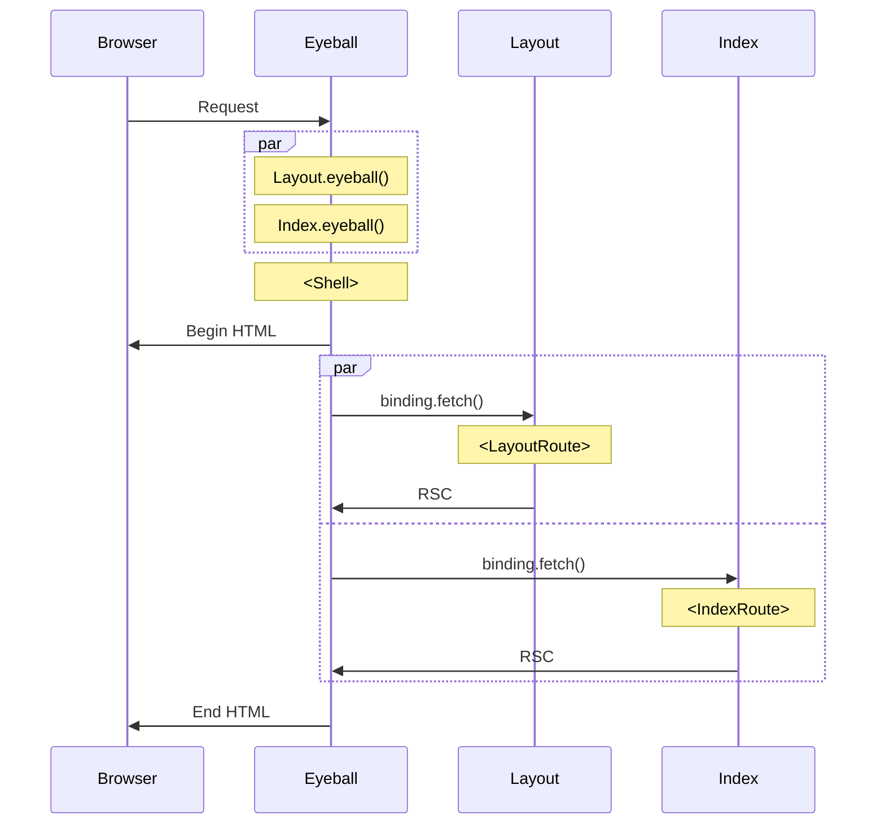

```mermaid
sequenceDiagram
    Browser->>Eyeball: Request
    par
        Note over Eyeball: Layout.eyeball()
        Note over Eyeball: Index.eyeball()
    end
    Note over Eyeball: <Shell>
    Eyeball->>Browser: Begin HTML
    par
        Eyeball->>Layout: binding.fetch()
        Note over Layout: <LayoutRoute>
        Layout->>Eyeball: RSC
    and
        Eyeball->>Index: binding.fetch()
        Note over Index: <IndexRoute>
        Index->>Eyeball: RSC
    end
    Eyeball->>Browser: End HTML
```
