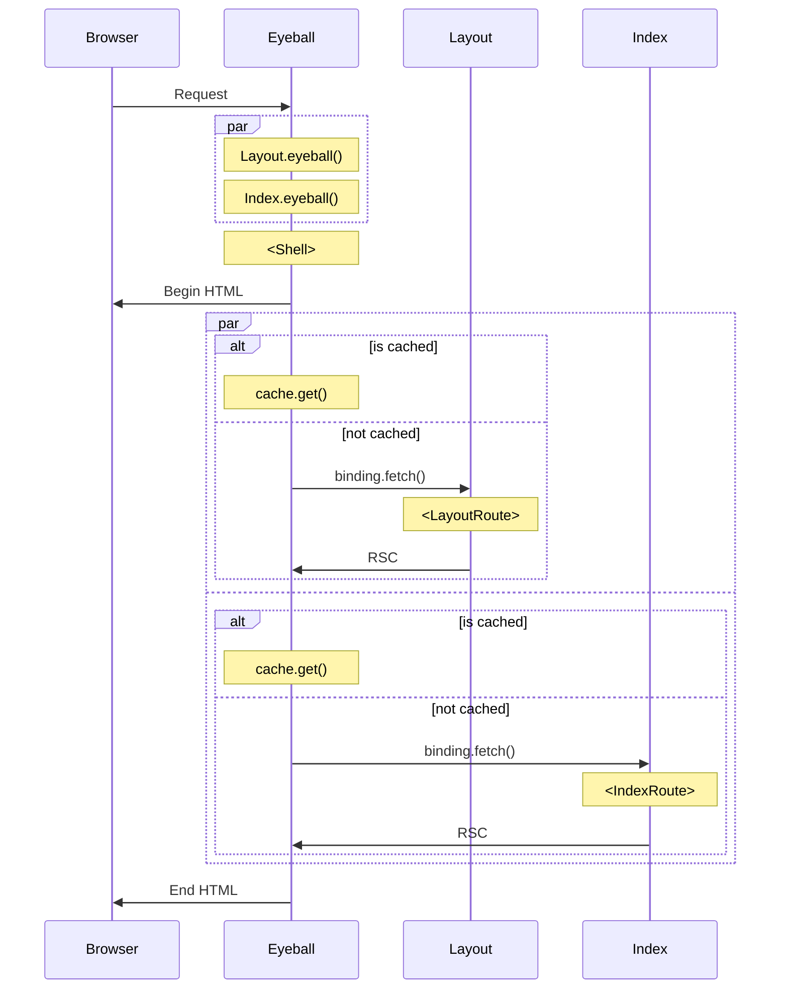

```mermaid
sequenceDiagram
    Browser->>Eyeball: Request
    par
        Note over Eyeball: Layout.eyeball()
        Note over Eyeball: Index.eyeball()
    end
    Note over Eyeball: <Shell>
    Eyeball->>Browser: Begin HTML
    par
        alt is cached
            Note over Eyeball: cache.get()
        else not cached
            Eyeball->>Layout: binding.fetch()
            Note over Layout: <LayoutRoute>
            Layout->>Eyeball: RSC
        end
    and
        alt is cached
            Note over Eyeball: cache.get()
        else not cached
            Eyeball->>Index: binding.fetch()
            Note over Index: <IndexRoute>
            Index->>Eyeball: RSC
        end
    end
    Eyeball->>Browser: End HTML
```
